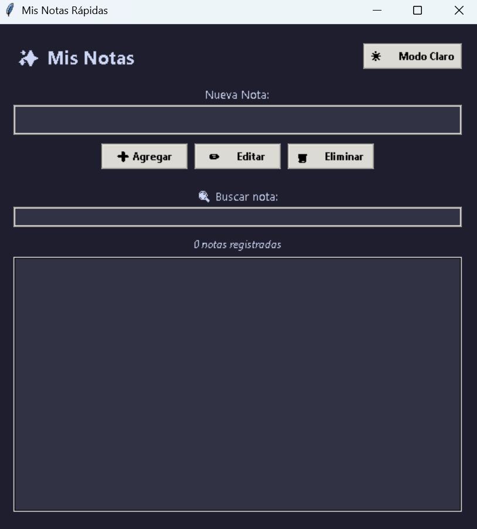
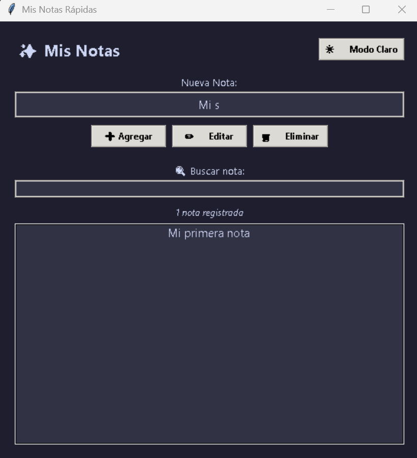
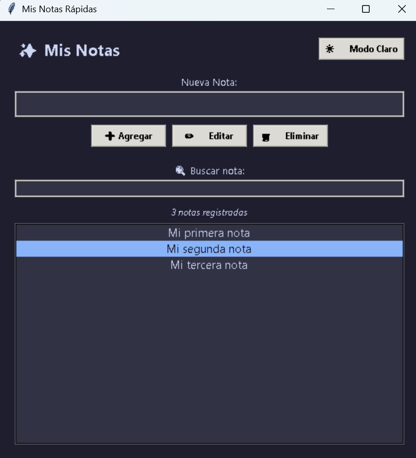
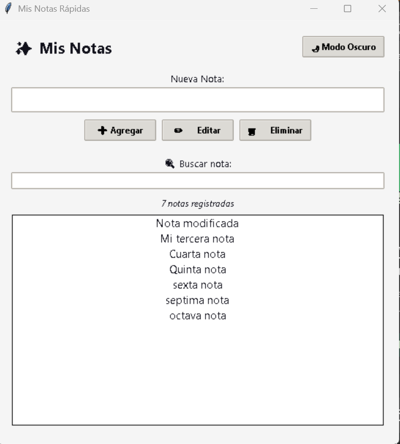
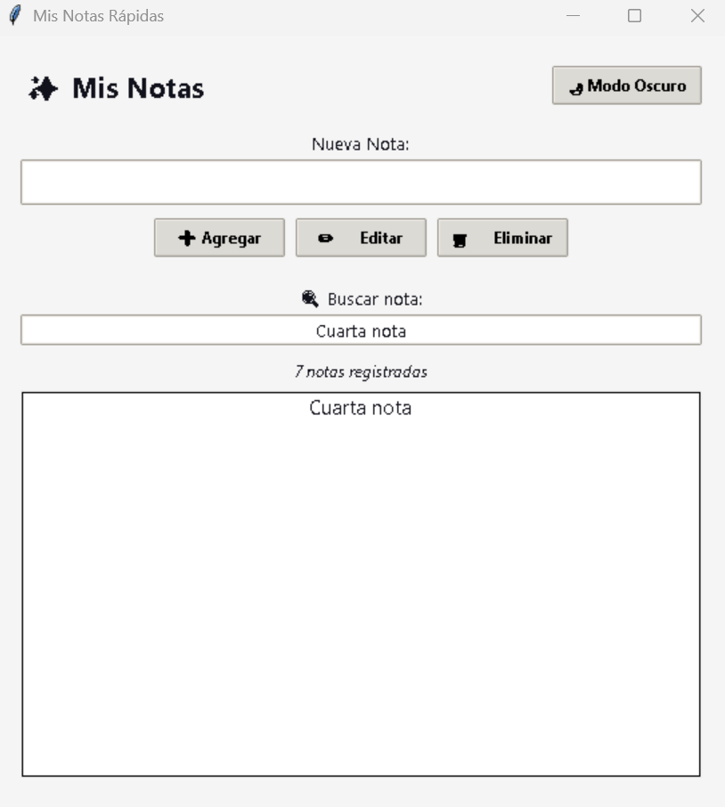

# Notas Rápidas

Aplicación de escritorio para la gestión de notas desarrollada en Python usando Tkinter y ttk.

## Características principales

- **GUI limpia y funcional:** Diseño centrado con paleta adaptativa y componentes ttk.
- **Manejo de eventos completo:**
  - `Enter` para agregar notas.
  - `Escribir en la búsqueda` para filtrar dinámicamente.
  - `Doble clic` en una nota para editarla.
  - Clic en los botones **Agregar**, **Editar**, **Eliminar** y el selector de tema.

## Extensiones implementadas

1. **Filtro / Búsqueda:** Búsqueda en tiempo real que filtra la lista al escribir.
2. **Persistencia de datos:** Guardado y cargado automático en un archivo `notas.json`.
3. **Temas Claro / Oscuro:** Cambiador de temas mediante estilos estilizados de `ttk`.

## Requisitos e Instalación

- Python 3.10 o superior.
- Tkinter (incluido en Python en Windows/Mac o instalado vía `sudo pacman -S python` en Arch Linux).

## Cómo ejecutar

```bash
python app.py
```

# Evidencias










