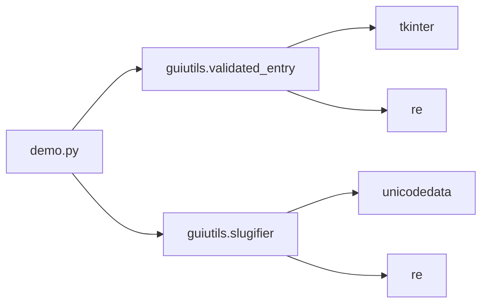

# Validia

Demo en Tkinter con dos componentes reutilizables empaquetados como librería local (`guiutils`): un campo de texto con validación en tiempo real y un generador de *slugs*.

## Características

- **ValidatedEntry**: `tk.Entry` que valida con una expresión regular (`fullmatch`) mientras escribes.
  - Borde y fondo gris/blanco si está vacío, verde si es válido, rojo si es inválido. El azul de foco se conserva al vaciar el campo.
  - Propiedad `.valid` para consultar el estado (con `pattern=None` siempre es `True`).
  - Colores configurables (`ok_color`, `bad_color`, `neutral_color`, `focus_color`, `ok_bg`, `bad_bg`, `neutral_bg`).
  - Respeta un `textvariable` propio si se pasa.
- **slug(text)**: convierte texto a formato URL: quita acentos, transliterá letras como `ß` u `ø`, elimina símbolos, pasa a minúsculas y une palabras con guiones, sin guiones en los extremos.
  - `"Canción Nueva!"` → `"cancion-nueva"`
  - Los alfabetos no latinos (cirílico, CJK...) se eliminan.
- **Demo** con interfaz de tarjetas: validación de correo y slug en vivo.

## Requisitos

- Python 3.8 o superior
- Tkinter (incluido con Python; en Linux: `sudo apt install python3-tk`)

No requiere dependencias externas.

## Estructura

```
.
├── demo.py
├── pyproject.toml
├── README.md
├── .gitignore
├── guiutils/
│   ├── __init__.py
│   ├── validated_entry.py
│   └── slugifier.py
└── tests/
    ├── test_slugifier.py
    └── test_validated_entry.py
```

## Diagrama de dependencias



```
demo.py
 ├── guiutils.validated_entry ── tkinter, re
 └── guiutils.slugifier ──────── unicodedata, re
```

## Instalación

Desde la raíz del repo, como paquete editable (no hace falta publicar en PyPI):

```bash
python3 -m venv .venv
source .venv/bin/activate        # Windows: .venv\Scripts\activate
pip install -e .
```

Para generar un paquete distribuible (`.whl`):

```bash
pip install build
python3 -m build
```

## Uso

```bash
python3 demo.py
```

### Usar los componentes en tu propio código

```python
import tkinter as tk
from guiutils import ValidatedEntry, slug

root = tk.Tk()

entry = ValidatedEntry(root, pattern=r"^\d{4}$", width=20)  # 4 dígitos
entry.pack(padx=10, pady=10)

print(entry.valid)                 # False
print(slug("Hola Mundo ¡Ñandú!"))  # hola-mundo-nandu

root.mainloop()
```

Con colores personalizados:

```python
ValidatedEntry(root, pattern=r"\d+", ok_color="#0ea5e9", bad_color="#f97316")
```

## Pruebas

```bash
python3 -m unittest discover -s tests -v
```

Las pruebas de `ValidatedEntry` se omiten automáticamente si no hay pantalla disponible.

## Parámetros de `ValidatedEntry`

| Parámetro | Descripción |
|-----------|-------------|
| `master` | Widget padre |
| `pattern` | Regex en texto. Si es `None`, todo es válido |
| `ok_color`, `bad_color`, `neutral_color`, `focus_color` | Colores del borde por estado |
| `ok_bg`, `bad_bg`, `neutral_bg` | Colores de fondo por estado |
| `**kwargs` | Cualquier opción de `tk.Entry` (`width`, `font`, `textvariable`, etc.) |

## Licencia

Libre uso educativo.
